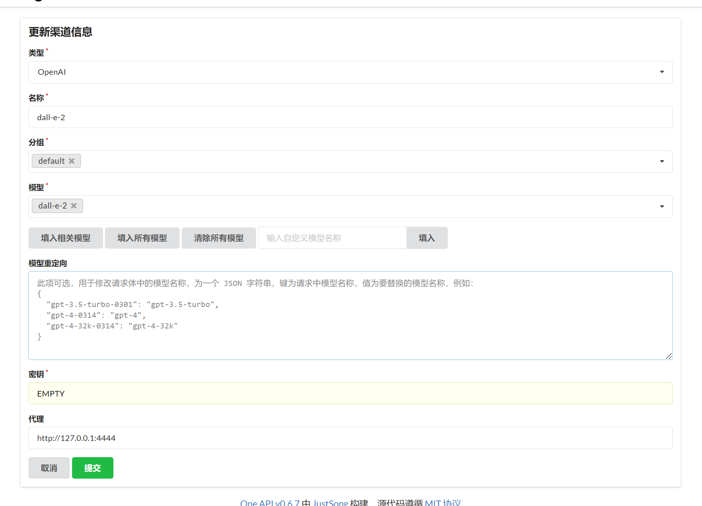

# sd 转 dall-e-2

## 配置请修改.env

## one api 渠道配置



## 可执行文件运行

自行查找github actions 最新产出的附件

[github actions](https://github.com/kongxiangyiren/dall-e-2/actions/)

## docker 运行

1、编译镜像

```sh
docker build -t dalle2 .
```

2、运行容器

```sh
docker run --restart=always -d -p 4444:4444 -v ./.env:/app/.env --name dalle2 dalle2
```
